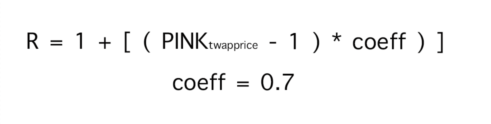

# 💵 Bond Mechanism

### What are $BLACK (Bonds)?

Bonds are unique tokens that can be utilized to help stabilize $PINK price around peg (1 FTM) by reducing circulating supply of $PINK if the TWAP (time-weighted-average-price) goes below peg (1 FTM).

### When can I buy $BLACK (Bonds)?

$BLACK can be purchased only during contraction periods, when **TWAP of** $PINK **is below 1**.

At the beginning of every new epoch during contraction periods, $BLACKs are issued in the amount of 3% of current $PINK circulating supply, with a max debt amount of 35%. This means that if bonds reach 35% of circulating supply of $PINK, no more bonds will be issued.


$BLACK TWAP (time-weighted average price) is based on $PINK price TWAP from the previous epoch as it ends.  This mean that $PINK TWAP is real-time and $BLACK TWAP is not.


### Where can I buy $BLACK (Bonds)?

You can buy $BLACKs if any are available, on the **Bonds** page at breakingfinance.xyz, anyone can buy as many $BLACKs as they want as long as they have enough $PINK to pay for them.

There is a limit of available $BLACKs per epoch during contraction periods (3% of $PINK's current circulating supply), and are sold first-come-first-serve.

### Why should I buy $BLACK (Bonds)?

First and most important reason is Bonds help maintain the peg, but they are not the only measure in place to keep the protocol on track.&#x20;

$BLACKs don't have an expiration date, so you can view them as an investment in the long-term health of the protocol to be redeemed for a premium at a later date.

#### Incentives for holding $BLACK

The idea is to reward $BLACK buyers for helping the protocol, while also protecting the protocol from being manipulated by big players.

So after you buy $BLACK using $PINK, you get 2 possible ways to get your $PINK back:

1. Sell back your $BLACK for $PINK **while the peg is between 1 - 1.1** (1 FTM) with no redemption bonus.  This is in place to prevent an instant dump as soon as peg is recovered.
2. Sell back your $BLACK for $PINK **while the peg is above 1.1** (1FTM) with a bonus redemption rate

The longer you hold, the more both the protocol and you benefit from $BLACKs.


Example:

1. When $PINK= 0.8, burn 1 $PINK to get 1 $BLACK ($BLACK price = 0.8)
2. When $PINK = 1.15, redeem 1 $BLACK to get 1.105 $PINK ($BLACK price = 1.27)&#x20;


So, which one is better?

If I buy $PINK at 0.8, and hold it until 1.15 and then sell, I'm getting +0.35$ per $PINK

But, if I buy $PINK at 0.8, burn it for $BLACK, and redeem it at 1.15, I'm getting 1.105 $PINK\* 1.15 ($PINK current price) = 1,271 (+0.47$) per $BLACK redeemed.

But what if getting back to peg is taking too long ?

We will adjust our use cases, to have different behaviors on contraction and expansion periods to benefit both $PINK and $BLACK holders when needed.

### What is the formula to calculate the $BLACK redemption bonus?

To encourage the redemption of $BLACK for $PINK when $PINK's TWAP > 1.1 and in order to incentivize users to redeem bonds at a higher price, $BLACK redemption is designed to be more profitable with a higher $PINK TWAP value. The $BLACK to $PINK ratio is 1:R, where R can be calculated using the formula as shown below:

### When can I swap $BLACK for a premium?

You can only redeem $BLACKs for a premium when the previous epoch's TWAP is greater than 1.1.
