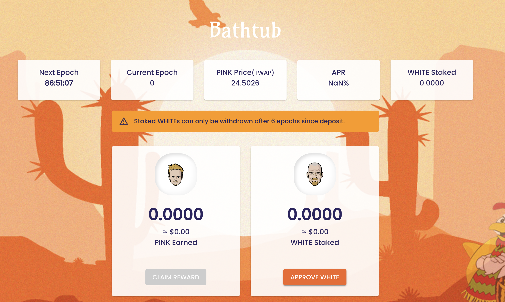
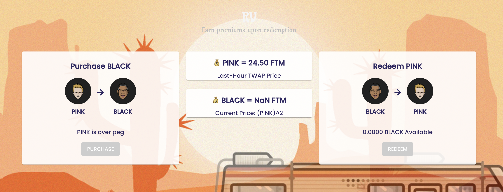

# 💡 Platform

## Bathtub (Boardroom)

* Epoch duration: 6 hours
* Any interaction with the Bathtub (staking/unstaking $WHITE or withdrawing $PINK rewards) will **lock your staked $WHITE for 6 epochs and $PINK rewards for 3 epochs.**&#x20;
*   Distribution of $PINK during Expansion

    **90%** as Reward for Boardroom $WHITE Stakers\
    **5%** goes to Community fund

    **5%** goes to DEV fund
* Epoch Expansion: The current expansion cap is based on the currently circulating $PINK supply (see below for details). If there are bonds to be redeemed, 65% of minted $PINK goes to the treasury until its sufficiently stocked to satisfy future bond redemption

| $PINK Circulating Supply | Max $PINK Minted |
| ------------------------ | ---------------- |
| Up to 1.5M               | 3% expansion     |
| Up to 5M                 | 2.5% expansion   |
| Up to 10M                | 2% expansion     |
| Up to 20M                | 1.5% expansion   |
| Up to 50M                | 1.25% expansion  |
| 50M+                     | 1% expansion     |


The Bathtub **does not** print any rewards for $WHITE stakers when the Bathtub TWAP < 1.01.


### Bathtub UI Information

Next **Epoch** indicates a countdown timer to the next epoch. (Each epoch duration lasts for 6 hours)                                                                                                              &#x20;

**APR** refers to the simple returns in USD value relative to the amount of $WHITE staked (USD value).\
_Note: **** APR fluctuates from time to time and is dependent on certain factors such as:_

* Price of $PINK
* Price of $WHITE
* Amount of $WHITE staked in Hatchery (Locked Value)

### Bathtub Debt Phase

A debt phase takes place during expansion epochs that start after a contraction period where there are still $BLACK to be redeemed.

65% of expansion during a debt phase is allocated to the treasury fund to prepare for subsequent $BLACK redemption down the road. This amount is always reserved, regardless of whether $BALCK holders are redeeming bonds or not.

Once enough $PINK is sufficiently stocked in the treasury to satisfy the redemption of all circulating $BLACK, expansion rates will resume to normal.

## COOK

To incentivize healthy liquidity pools for the Breaking Finance protocol tokens, our LP COOKs have been seeded with $WHITEs to be distributed as rewards to LP stakers across a time period of 12 months. The total $WHITE rewards are distributed from each COOK as follows:

* $PINK-FTM LP: 6,500 $WHITE
* $WHITE-FTM LP: 2,500 $WHITE

## RV

$BLACK (bond tokens) are available for purchase when $PINK falls below the 1 FTM peg. If $PINK's TWAP is between 1.00 and 1.01, neither $BLACK nor $PINK will be issued.

Check out the [Bonds Mechanism](broken-reference) section for a detailed breakdown of how bonds work.
