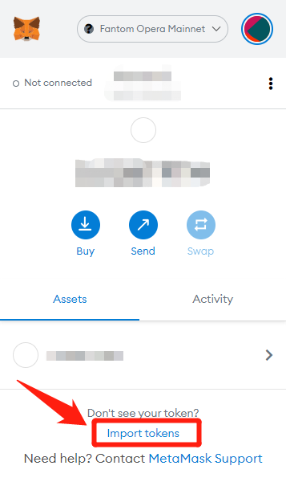
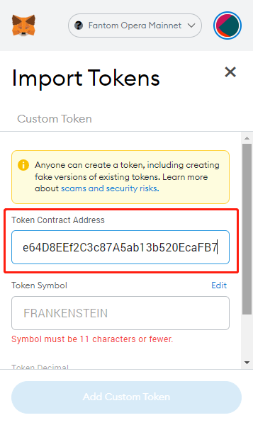
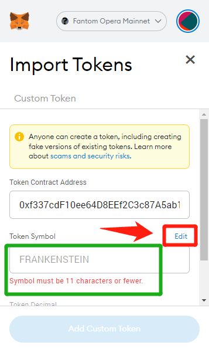
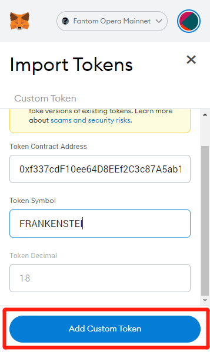
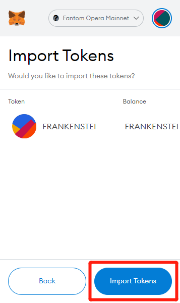
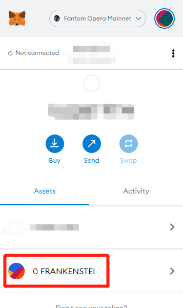

# 🔴 Adding $FRANKENSTEIN to your Metamask wallet

**Step 1** Click Import tokens

**Step 2** Copy “0xf337cdF10ee64D8EEf2C3c87A5ab13b520EcaFB7” to Token Contract Address

**Step 3** Click Edit&#x20;

**Step 4** Rename Token Symbol and click Add Custom Token

**Step 5** Click Import Tokens

**Step 6** Succeeded

