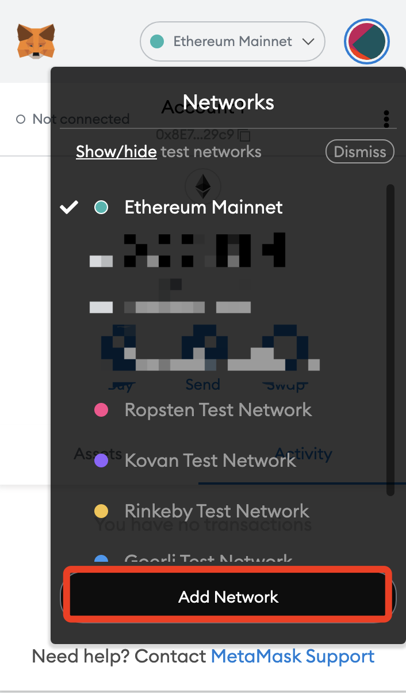

# 🔴 Adding FTM Chain to your Metamask wallet

**Step 1.** Metamask setup&#x20;

* Before being able to buy $PINK, we first need to setup our Fantom network on Metamask.
* In order to do so, please open your Metamask wallet and select network; Custom RPC. (See attached image below).

* Now put in the following in order to setup your Fantom wallet.
* 1\. **Network name**: Fantom Opera
* 2\. **New RPC URL**: [https://rpcapi.fantom.network](https://rpcapi.fantom.network)
* 3\. **ChainID**: 250
* 4\. **Symbol**: FTM
* 5\. **Block Explorer URL**: [https://ftmscan.com/](https://ftmscan.com)
